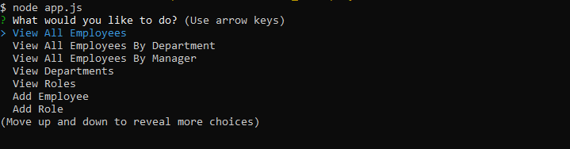

# employee-tracker

Node js CLI that tries to keep track of employee information using a basic CRUD design using MYSQL and inquirer.

## Built with

- Node.js
- Inquirer.js
- MYSQL

## Usage

Allows you to view the employees you have as well as their role and what department they work in. Pertinent information can be read, created updated or deleted.

